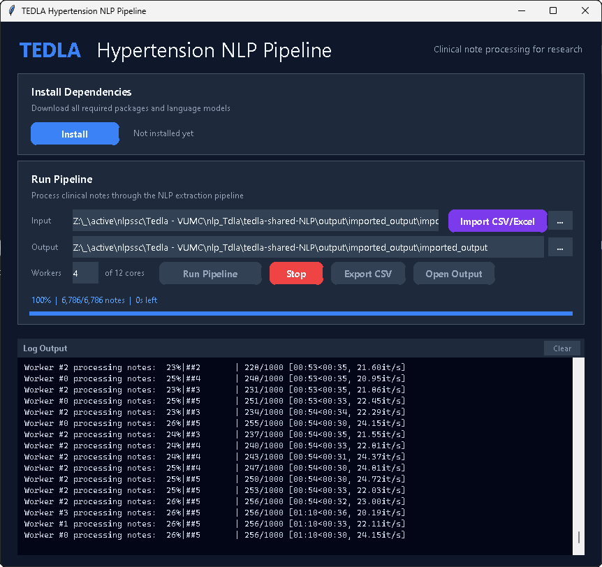

# Hyptertension Term Search with NLP

Pipeline Documentation: [TEDLA_Pipeline_Documentation.pdf](./TEDLA_Pipeline_Documentation.pdf).
Data Dictionary for Output: [resources\data-dictionary.pdf](./resources/data-dictionary.pdf)

## Quick Start with Sample Mock Data

Import sample data found at [resources\sample_data\mock.note_data.csv](./resources/sample_data/mock.note_data.csv).

## Validation

[notebooks\output-validation_csv_to_sqlite_results.ipynb](./notebooks/output-validation_csv_to_sqlite_results.ipynb)

The `results` table contains the output from the NLP algorithm.  The [data-dictionary.pdf](./resources/data-dictionary.pdf) contains a description of the results table schema.

