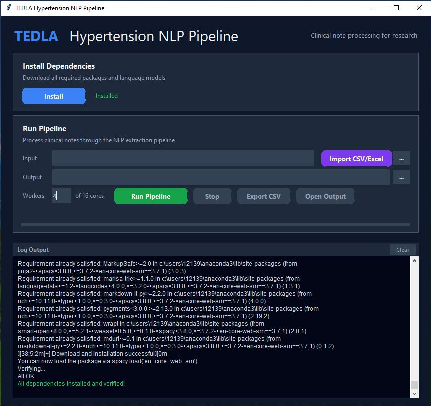

# Hyptertension Term Search with NLP

GitHub: https://github.com/NLPSSC/tedla-shared-NLP

Documentation for this tool's use can be found in [TEDLA_Pipeline_Documentation.pdf](TEDLA_Pipeline_Documentation.pdf).



## Trying Out Sample Data

Import sample data found at [./sample_data/mock.note_data.csv](./sample_data/mock.note_data.csv).


Once the tool complete, there will be a SQLite database for each worker thread.  [combine_results.bat](./combine_results.bat) wraps a call to [combine_output.py](./hypertension-nlp/src/results/combine_output.py), which demonstrates how these results can be combined into a unified SQLite database.

combine_results.bat                                               

```shell                                               
   ====================================================
     TEDLA Hypertension NLP Pipeline - Combine Output
   ====================================================

   Starting combination of output databases...

Error: --input argument is required.
usage: combine_output.py [-h] --input INPUT [--output OUTPUT]

Combine SQLite result databases into one.

options:
  -h, --help       show this help message and exit
  --input INPUT    Path to the folder containing result .db files
  --output OUTPUT  Path to the folder for the combined output .db file. If not provided, a "combined_output" folder will be created in the     
                   input folder.
```

The `results` table contains the output from the NLP algorithm.  The [data-dictionary.pdf](./resources/data-dictionary.pdf) contains a description of the results table schema.

## ETL Details

The details on how the data for this was built can be found in [resources\nlp_pipeline_sql.pdf](resources\nlp_pipeline_sql.pdf)