# Hyptertension Term Search with NLP

Pipeline Documentation: [TEDLA_Pipeline_Documentation.pdf](./TEDLA_Pipeline_Documentation.pdf).
Data Dictionary for Output: [resources\data-dictionary.pdf](./resources/data-dictionary.pdf)

## Quick Start with Sample Mock Data

The following provides a "Quick Start" guide to downloading and using the tool.  It presumes a Windows environment with access to the Internet.

### Create Folder for Pipeline

In a command prompt, prepare a directory for the pipeline and change directory into it.

```shell
mkdir nlp_pipeline
cd nlp_pipeline
```

### Download Pipeline Code

This is a publicly available repository, which you can pull local to your machine from GitHub.  

**Using Git**

If you are already familiar with how to use `git`, you can clone the repository from within the `nlp_pipeline` folder using the command

```shell
git clone --depth=1 https://github.com/NLPSSC/tedla-shared-NLP.git .
```

This will clone latest commit into the `nlp_pipeline` folder.

**Download Release from Browser**

You can also navigate to the [release page for the project](https://github.com/NLPSSC/tedla-shared-NLP/releases/tag/0.1.0), and download the source in your preferred archive format into the `nlp_pipeline` folder.

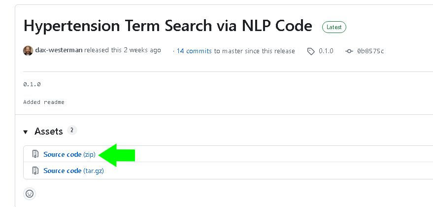

**Expected Project Files**

Once you have cloned or downloaded and extracted the files, the `nlp_pipeline` folder will look like 

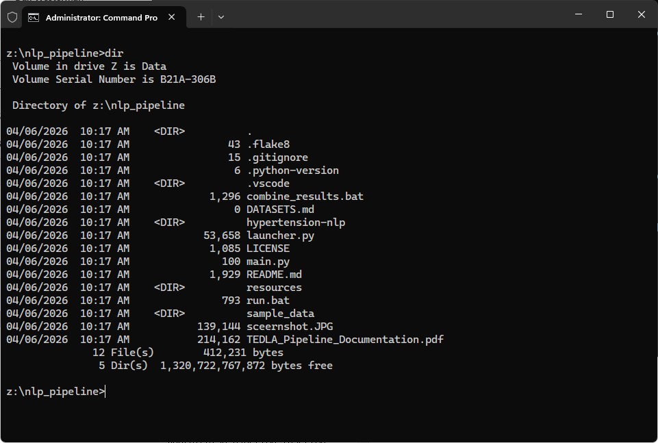

### Trying Out the Pipeline with Mock Data

Mock data has been provided (non-PHI, non-PII), which simulates the data you will generate with your implementation of the SQL to build out the dataset.  You can review this mock data using the [jupyter notebook](./notebooks/mock_data_viewer.ipynb) provided.


**Quick Start Steps:**

1. Run `run.bat` within the `nlp_folder` to start the pipeline.

As executed in the command window...
<div>
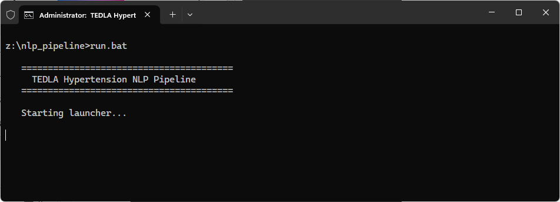
</div>

This opens the user interface.
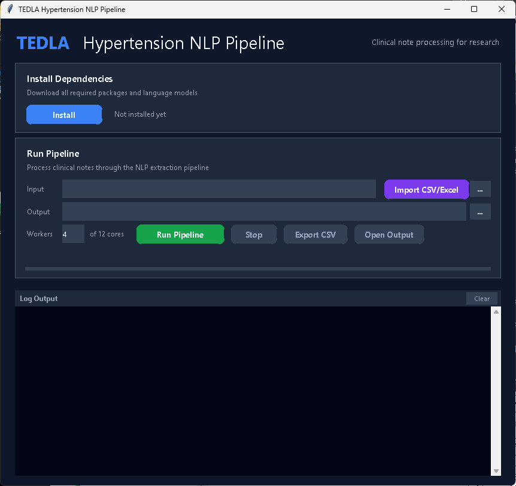

2. Click the "Install" button to create the python environment.

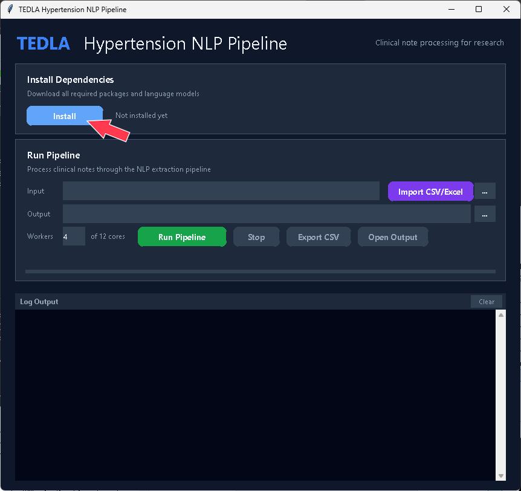

This will set up the python environment.

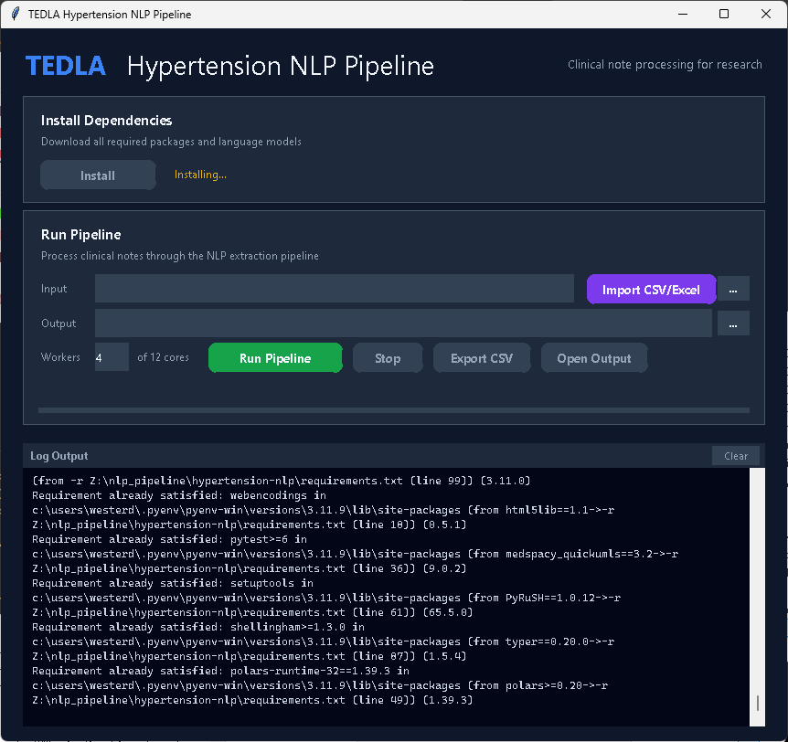

3. Once the python environment setup is complete, click the "Import CSV/Excel" button to import the mock data.  

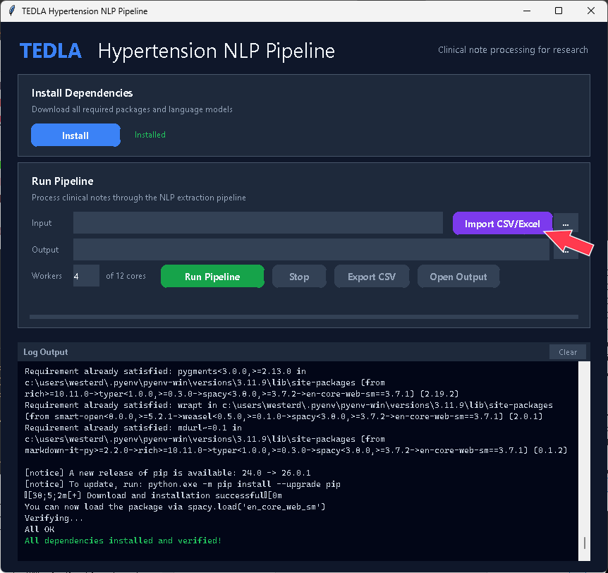


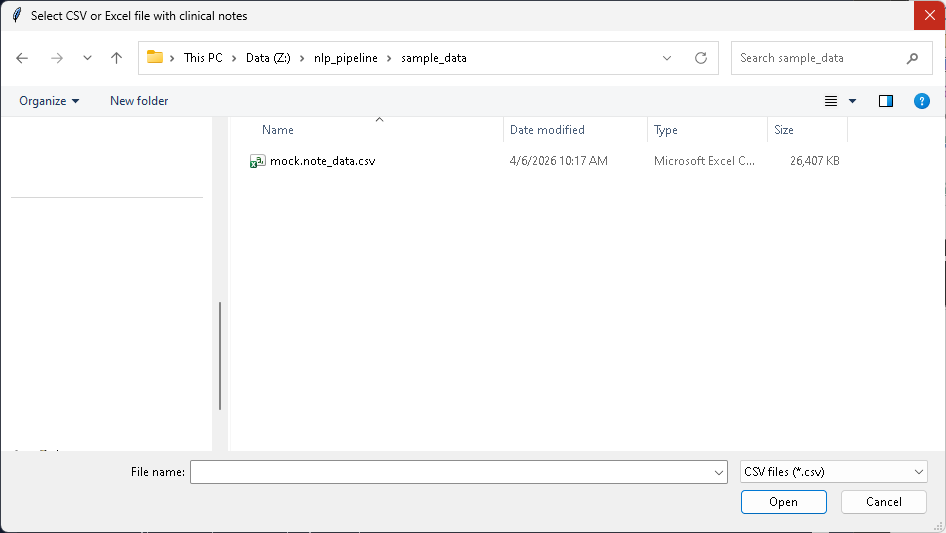

This will automatically ask for the preferred location of the output for the NLP pipeline.  Create a folder, if needed, and select that folder in the next dialog (using the sample_data folder for this example).

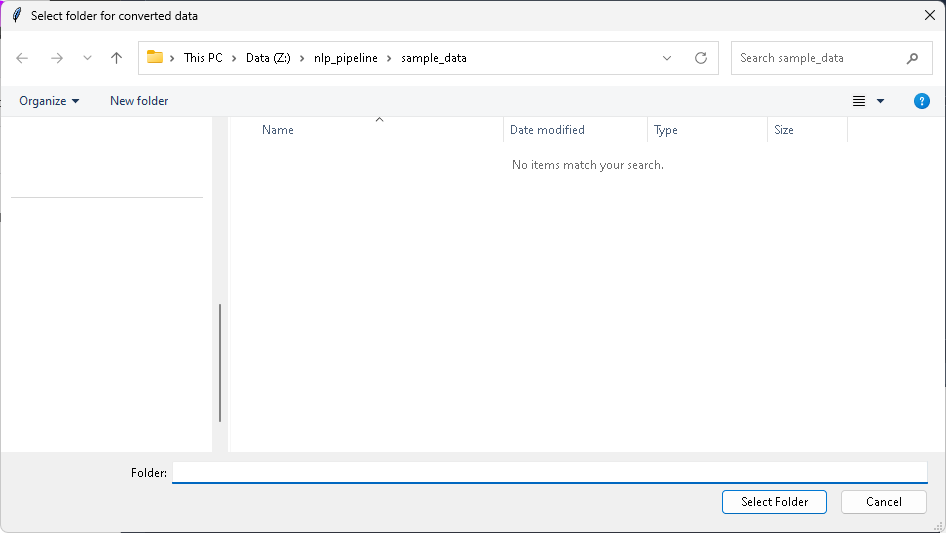

This will create two new folders: `imported_input` and `imported_output`.  The output from the NLP pipeline will later be found within `imported_output`.

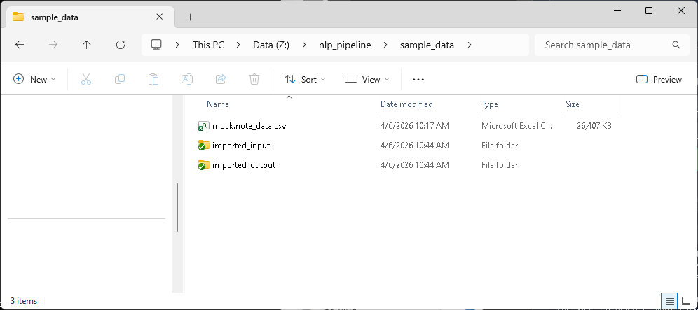

4. Configure the number of workers with which you want to run the pipeline, and click the "Run Pipeline" button to start the process.

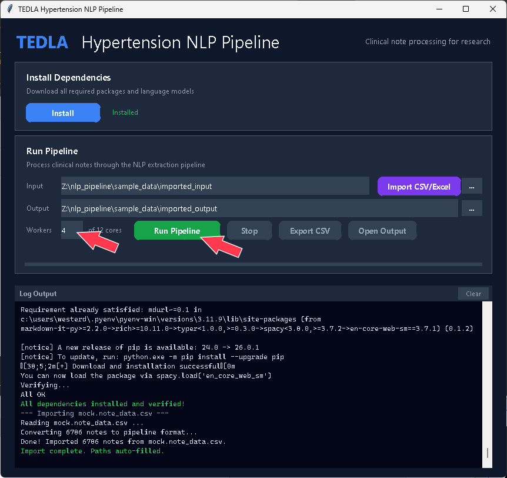

5. Once the pipeline has completed, 

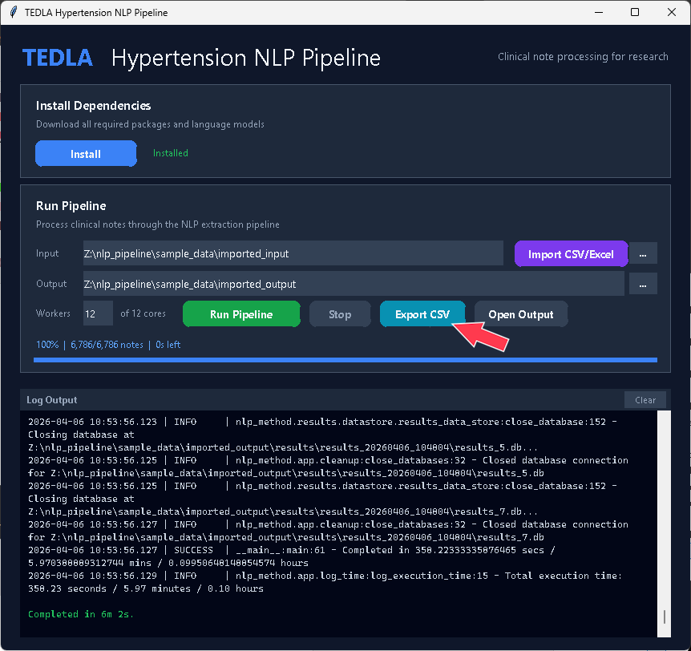   
   
you can export the results to a CSV file by clicking the "Export CSV" button and selecting a destination folder.

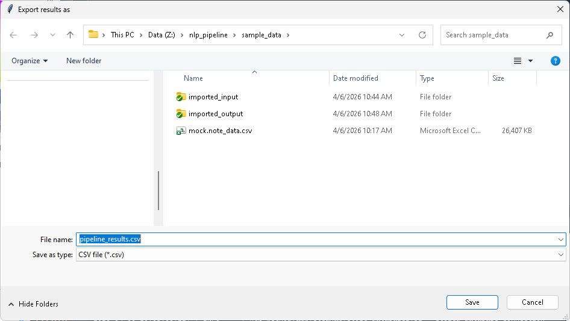


The [data-dictionary.pdf](./resources/data-dictionary.pdf) contains a description of the results table schema.

6. At this point the pipeline is complete with the results in the exported CSV file.


### Next Steps

Review the documentation on building the SQL ETL in your local environment, located in [resources\sql_defining_notes_to_process.md](./resources/sql_defining_notes_to_process.md)