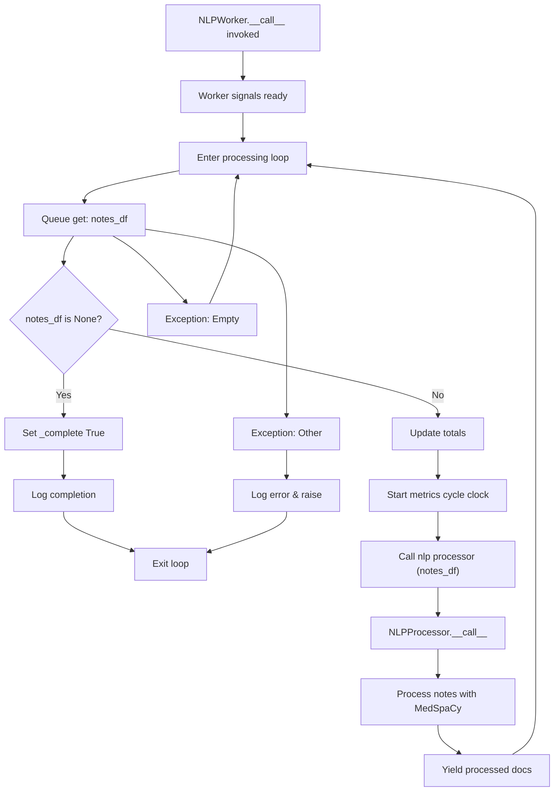

# NLPWorker.__call__ Workflow Diagram

This diagram illustrates the workflow path taken when the `__call__` method is invoked on an `NLPWorker` instance, including the call to `NLPProcessor.__call__` and note processing with MedSpaCy.

